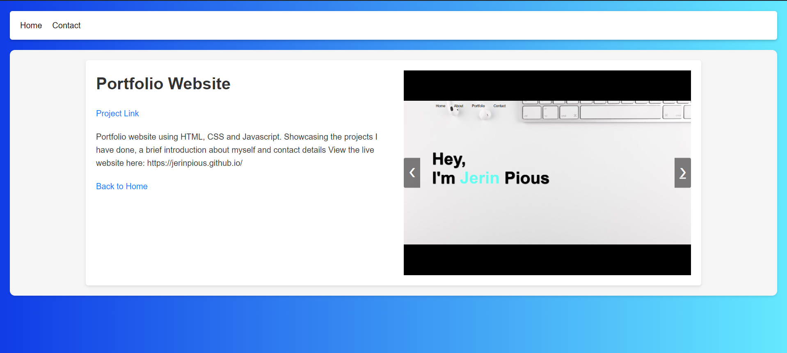

# Django-Portfolio
Django based portfolio website inspired by tech with tim. The portfolio showcases the diffrent projects that I have done also allowing th eviewer to use filters and search tools for better navigation.

## Screenshots

Home page that lists the projects with the heading, description and tagsa

Project page that displays the images of the project, the full description and a link to the project git repository

### Installation
- Python 3.8+
- Django

- Clone the repository
~~~
 git clone https://github.com/jerinpious/Django-Portfolio.git
 cd portfolio
~~~
- Install the required packages:
~~~
pip install -r requirements.txt
~~~
- Run the Django server:
 ~~~
 python manage.py runserver
 ~~~

### Contributing
Contributions are welcome! Please fork the repository and create a pull request with your changes.
